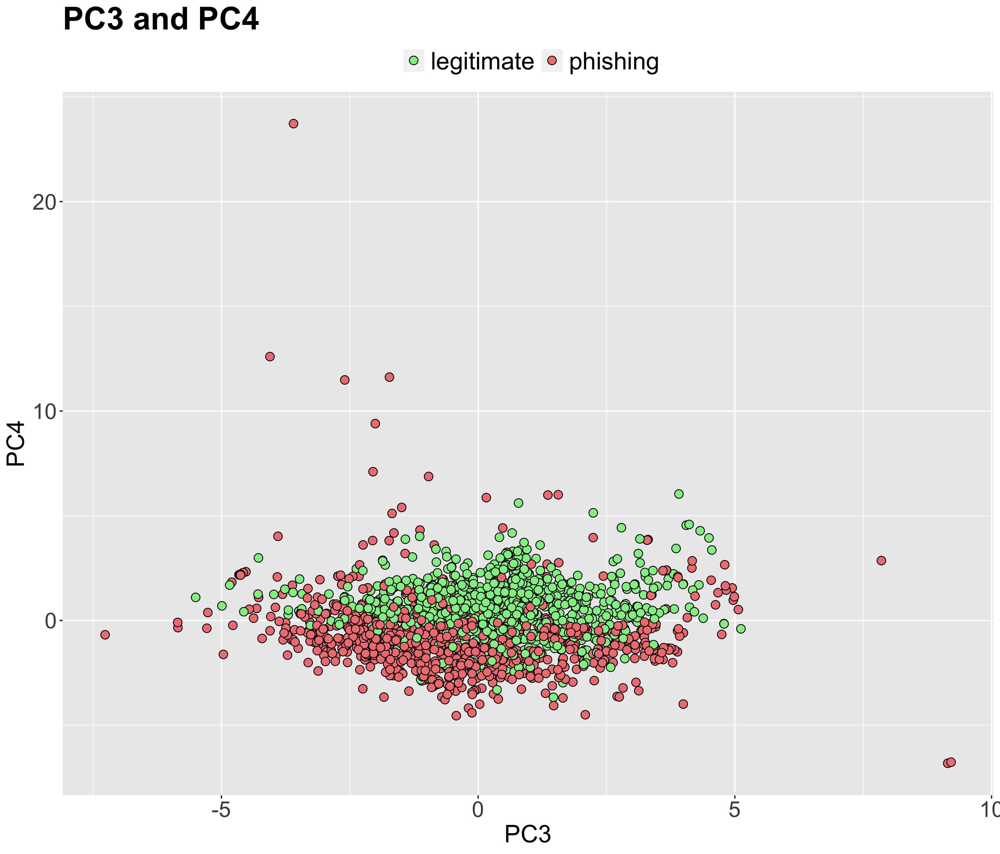
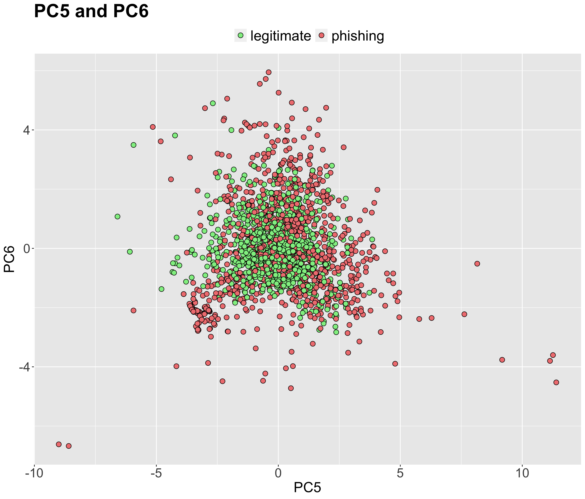
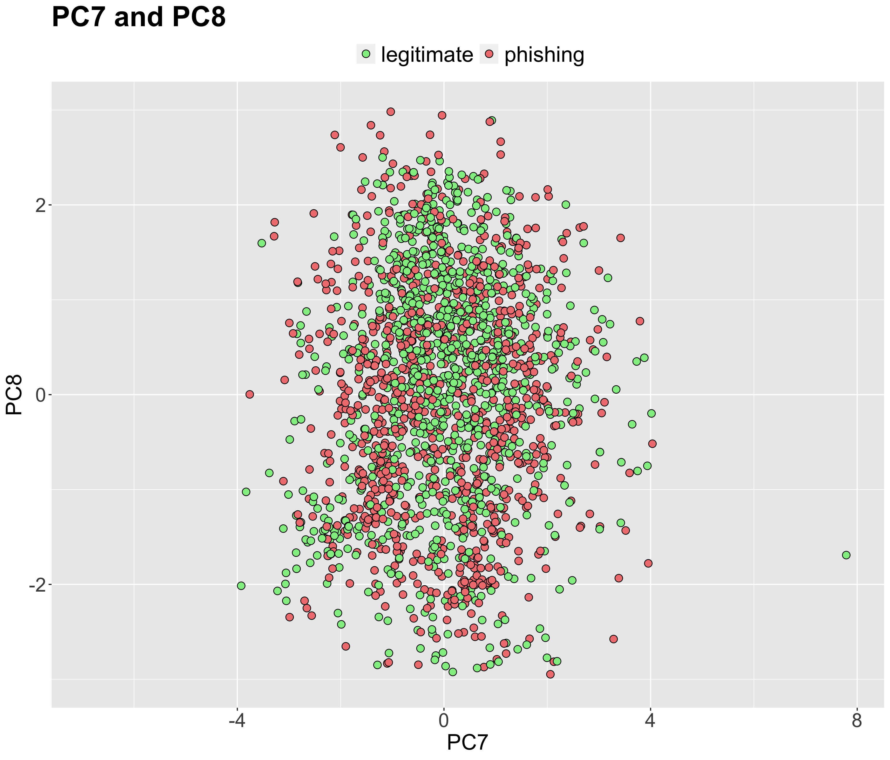
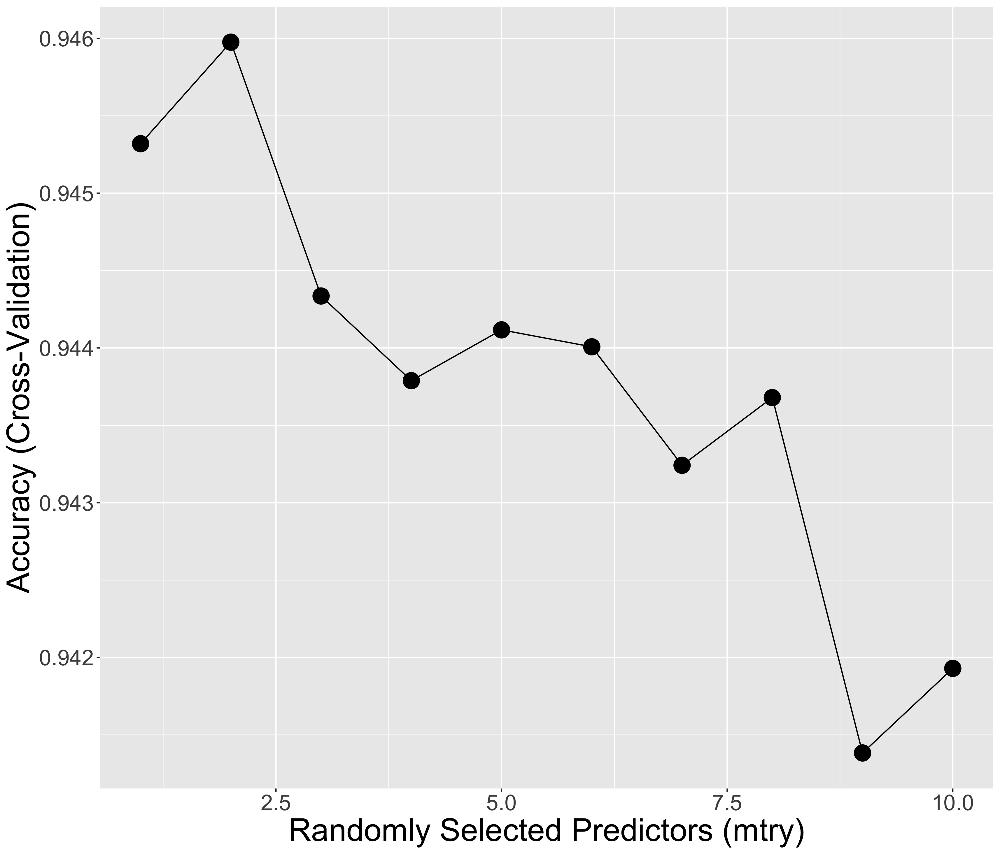
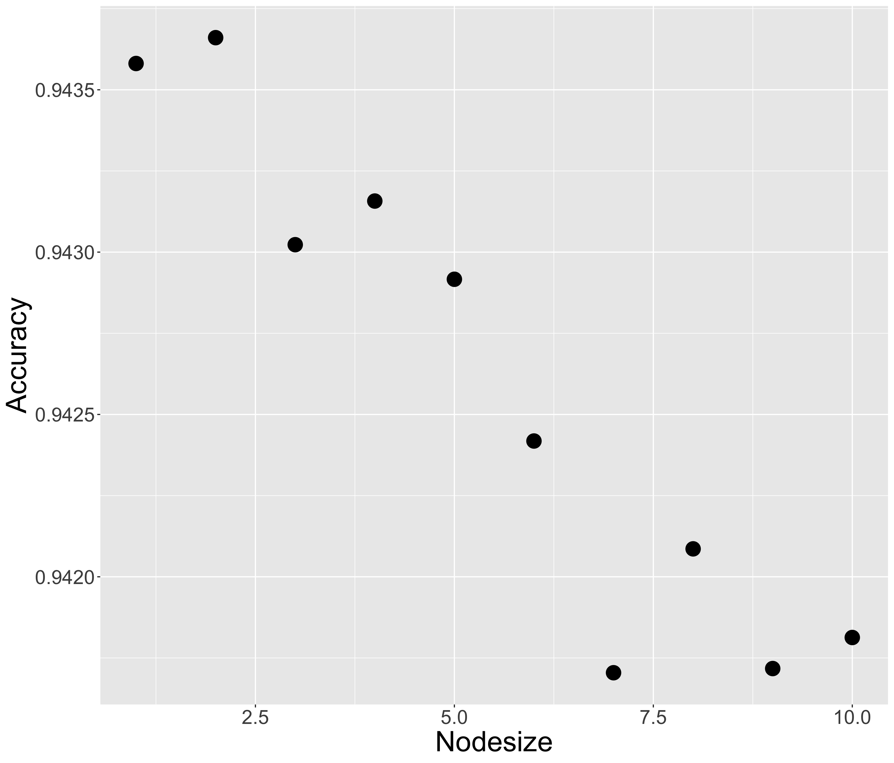

```{r setup, include=FALSE}
knitr::opts_chunk$set(
  echo           = TRUE,    
  message        = FALSE,   
  warning        = FALSE)
  
options(scipen  =999)
```

```{r load, echo=FALSE}
library(tidyverse)
#library(matrixStats)
library(RColorBrewer)
load("rdas/phish.rda")
load("rdas/x_train.rda")
load("rdas/y_train.rda")
```
------------------------------------------------------------------------
# Introduction

## Objective 

Phishing is a fraudulent activity where a cyber criminal sends communications (often email) pretending to be from a legitimate company, to lure a victim into providing personal information on a fraudulent web page. 

The goal of this project is to train several widely used algorithms to predict whether a web page is legitimate or fraudulent, based on different characteristics of the page such as the syntax of its web address (URL), content, and information returned by external services


## Dataset Description

The Web Page Phishing Detection dataset contains information about web pages classified into *legitimate* or *phishing*. It is available from Kaggle at: [Web Page Phishing Detection Dataset](https://www.kaggle.com/shashwatwork/web-page-phishing-detection-dataset)


The dataset classifies 11430 web pages, and includes 87 features grouped into 3 categories: 

* 56 extracted from the syntax of the URL, such as its length (`length_url`) or count of dots (`nb_dots`)

* 24 from the content of the web page, such as whether it requests user login information (`login_form`) or the percentage of tags that contain an actual link to other web pages (`links_in_tags`) 

* 7 obtained by querying external services, such as the number of times the page is served (`web_traffic`) 


## Key Activities

Following is an outline of the key steps performed in this project:  

- After downloading and cleaning the data, we remove features that don't vary much (near-zero variability), and normalize the data to bring it to a similar scale.

- Next we use visualization and clustering techniques to explore opportunities to further decrease the large number of predictors in the dataset.

- We use Principal Component Analysis (PCA) to reduce dimensions. This makes it easier to visualize relationships in the data, and will improve the performance of the ML algorithms we are building.

- After applying the PCA transformation, we train some of the most common caret models (Naive Bayes, LDA, QDA, kNN and Random Forest) using 80% of the observations. The remainder 20% is used to evaluate the algorithm.

- Lastly, we further improve performance by tuning hyper-parameters, and by combining the best performing models into an ensemble to generate a majority prediction of the web page type.

- Results are then presented followed by conclusions and recommended next steps.


# Analysis
## Data Cleaning and Preparation

### Downloading and cleaning the data
We start by downloading the dataset from Github, where we have created a copy for simplicity 

\small
```{r dowload, echo=TRUE, eval=FALSE}

file_url<- "https://raw.githubusercontent.com/ruthparras/phishing/main/dataset_phishing.csv"
phish<- read_csv(file_url)   # read csv file  directly 
```
\normalsize


The downloaded *phish* object is a dataframe consisting of the URL of the page  (`phish$url`), a character string (`phish$status`) representing the label *phishing* or *legitimate*, and 87 other numeric features.

After removing the URL from the dataframe (since it lacks predictive information), we transform the label into factors and validate that there are no missing values (NA) to replace or exclude.


### Removing near-zero variance predictors 

A plot of the standard deviation for each feature shows that there is a group with very low variability. We can zoom-in to display the count of features with a standard deviation lower than 0.5.
 \newline

```{r sds_figures, echo=FALSE, out.width="45%"}


```
 \newline

 \linebreak

After removing 35 features with low predictive power (variability) as proposed by the **nearZeroVar** function, the number of predictors goes down to  `r dim(phish)[2]-1` 

\small
```{r nearzerovar, echo=TRUE, eval=FALSE}

nzv <- nearZeroVar(phish)  # recommend features with near zero variability
phish<- phish[, - nzv]  # remove those features
```
\normalsize

### Scaling the data

From the summary statistics of a few features in *phish*,  we easily observe that they have different ranges. For example, *length_url* ranges from 12 to 1641, while *web_traffic* goes from 0 to over 10.8M. However, this difference in range doesn't mean that one feature has 10M times more predictive power than the other.

\small
```{r summary, echo=FALSE, eval=TRUE}
# display summary statistics for selected features
small_phish<- phish %>% select(length_url, nb_dots, links_in_tags, web_traffic)  
knitr::kable(summary(small_phish))
```
\normalsize

To ensure that each variable contributes equally to the analysis, we normalize the data and bring it to a similar scale without distorting differences in the ranges of values. 

\small
```{r scale, echo=TRUE, eval=FALSE}

# Transform predictors into a matrix, center and scale. 
phish_y <- phish$status
phish_x <- phish %>% select(-status) %>% as.matrix()

phish_x_centered <- sweep(phish_x, 2, colMeans(phish_x)) # subtract the mean 
phish_x_scaled <- sweep(phish_x_centered, 2, colSds(phish_x), FUN = "/") # divide by SD
```
\normalsize

###  Checking for data imbalances

Next, we check for imbalances in the data that might lead to prediction bias. By calculating the proportion of each classification, we confirm that the dataset is balanced, containing exactly `r mean(phish$status =="phishing") * 100`% phishing and `r mean(phish$status =="legitimate") * 100`% legitimate URLs.

### Preparing the training and testing sets

Finally, we randomly partition the data into a 80% training and 20% test sets.

\small
```{r partition, echo=TRUE, eval=FALSE}
# Create a 80/20 random partition of the data
set.seed(123, sample.kind = "Rounding")    # if using R 3.6 or later
test_index <- createDataPartition(phish_y, times = 1, p = 0.2, list = FALSE)  

x_test <- phish_x_scaled[test_index, ]
y_test <- phish_y[test_index]
x_train <- phish_x_scaled[-test_index, ]
y_train <- phish_y[-test_index]
```
\normalsize

 \linebreak

## Data Exploration and Visualization

Rather than using the full *phish* dataset, we explore the data in the *train_set* alone, to make sure that "unknown" information from the *test_set* is not "leaked" and used during the prediction. The first few rows and columns of the scaled *train_set* look like this :

\small
```{r x_train_str, echo=FALSE, eval=TRUE}
train_set<- data.frame( status = y_train, x_train)
knitr::kable(train_set[1:5,1:5])
```
\normalsize


*train_set* contains `r  dim(x_train)[1]` observations (web pages) classified into *legitimate* or *phishing*. Each observation consists on `r dim(x_train)[2]` predictors, after removing 35 features with near zero variability.


### Visualizing feature relationships

Visualizing the relationships among 52 features is a vast task. Instead, we use a heatmap to find groups of features that are in closer proximity, hence, creating an opportunity for dimension reduction. 


\small
```{r heatmap_code, fig.align='center', out.width="75%", echo=TRUE, eval=TRUE}
d_features <- dist(t(x_train))  #  transpose x_train to calculate distance between features
heatmap(as.matrix(d_features),   # display a heatmap
        col = colorRampPalette(brewer.pal(9,"Blues"))(9))

```
\normalsize

The heatmap displays pockets of features that are closer together (lighter color).
 \newline

We can further validate the proximity among features by performing hierarchical clustering and visualizing the result with a dendrogram. 

\small
```{r cluster, echo=TRUE, fig.align='center', out.width="75%",eval=TRUE}
# group features into clusters
h <- hclust(d_features)    

#summarize clustering information with a dendrogram
plot(h, cex = 0.65, xlab = "", sub = "", main="")  

```
\normalsize
 \newline

### Reducing Dimensions with Principal Component Analysis 

As discussed in the previous section, there are groups of features that are closer together creating an opportunity to decrease the dimensions in the dataset. 

**Principal Component Analysis** (PCA) achieves this by calculating *principal components* which are feature combinations that represent the most important differences (variance) in the data, while eliminating feature overlap (redundancy) 

Let's apply PCA to the training set and display the first 10 principal components ordered by how much variance they explain:


\small
```{r pca, echo=TRUE, eval=TRUE}

pca <- prcomp(x_train) # retrieve all principal components in the train set
summary(prcomp(x_train, rank.=10))  # display the first 10 (out of 52) 

```
\normalsize

The first two principal components explain 21% of the variance. To decide how many components we need, we plot the proportion of variance and its cumulative sum, with variance defined as `(pca$sdev^2)/sum(pca$sdev^2)`:
 \newline

```{r pc_variance, echo=FALSE,,out.width="45%"}


```
 \newline

The first plot shows that the first components explain significantly more variance than the rest. Using the second plot, we can easily determine that 20 components result in variance close to 76%. In other words, **using PCA we can reduce  `r dim(x_train)[2]` predictors to 20 and still explain 76% of the variance in the data**.


### Data Visualization using PCA

Dimension reduction makes data easier to visualize. Let's do a boxplot of the first 5 principal components grouped by status.

```{r boxplot_pcs, echo=FALSE, fig.align='center', out.width="60%"}


```

PC1 and PC4 are significantly different by page status as demonstrated by the little overlap in the interquartile ranges (IQRs). This means that they have the most predictive power. However, PC1 only explains 13% of the variance in the data, while PC4 0.6%, so we need to consider more components to account for more variance and make better predictions.
 \newline

Let's plot the relationship among the first 8 components.
 \newline

```{r pc_plot, echo=FALSE, out.width="50%"}



```

```{r pc_plot2, echo=FALSE, out.width="50%"}



```
 \newline

The plot between PC1 and PC2 shows a clear separation between web pages: phishing sites tend to have larger values of PC1. We are also able to separate each class in the plot between PC3 and PC4. However, as we move from PC5 to PC8, it becomes increasingly difficult to separate sites
 \newline

## Insights

The biggest challenge in this project is the large number of predictors (87) included in the original dataset. After removing those with near-zero variability, we are still left with 52. 

Using a heatmap and a dendrogram to visualize the distance among features, we observe that there is overlap among them, which creates an opportunity for decreasing the number of predictors even further.  

**Principal Component Analysis** (PCA) proves very effective in reducing dimensions from `r dim(x_train)[2]` to 20, while still being able to explain 76% of the variance in the data, and therefore make good predictions.

 \newline

# Modeling Approach

Leveraging the insights gathered from the PCA analysis, we reduce the number of dimensions in the training set by selecting PC1 to PC20 as predictors. Then, we apply the same PCA transformation to the test set to rotate it to the same dimensional space as the training set. 

\small
```{r train_pca, echo=TRUE, eval=FALSE}
dim<- 20 # select the first 20 principal components
x_train_pca <- pca$x[ ,1:dim] # reduce dimensions of training set to 20

x_test_pca <- sweep (x_test, 2, colMeans(x_test)) %*% pca$rotation  # apply PCA to test set.
x_test_pca<- x_test_pca[ ,1:dim]  # reduce dimensions of testing set to 20 

```
\normalsize


## Naive Bayes, LDA, QDA, kNN, Random Forest
Next we train 5 of the most common caret models using default parameters. We apply each fitted model to the test set to make predictions and compare them with known outcomes to evaluate performance. 

\small
```{r train_models, echo=TRUE, eval=FALSE}
models <- c("naive_bayes", "lda", "qda", "knn", "rf") # 5 common models in caret

fits <- lapply(models, function(model){  # train using default parameters.
  print(model)
  set.seed(1, sample.kind = "Rounding") # if using R 3.6 or later
  train(x_train_pca, y_train , method = model)   })
names(fits) <- models  # set the name of each model

# create matrix of predictions by applying each fitted model to the test set
predictions <- sapply (fits, function(fits){
  predict (fits, newdata= x_test_pca) })  
  
results <- sapply(c(1:5), function (col) {  # compare the predictions with known outcomes.
     y_hat<-factor(predictions[,col])   
     cm<- confusionMatrix(y_hat, reference = y_test)  })  # store output of cm in results

```
\normalsize

 \newpage

## Tuning kNN
To further improve performance, we tune the hyper-parameters of the best performing models above: kNN and Random Forest. For kNN, we use 10-fold cross-validation to find that the value of k-neighbors that maximizes accuracy is 3.


\small
```{r train_knn, echo=TRUE, eval=FALSE}
k<- seq(1, 19, 1) 
control<- trainControl(method = "cv", number = 10, p = .9) # 10 fold cross-validation

set.seed(123, sample.kind = "Rounding") # if using R 3.6 or later
train_knn <- train (x_train_pca, y_train, method = "knn",
                    tuneGrid = data.frame (k),
                    trControl=control)

k_opt <- train_knn$bestTune$k # value of k that maximizes accuracy

# fit kNN with optimized k to the entire training set
fit_knn <- knn3 (x_train_pca, y_train, k= k_opt)
y_hat_knn <- predict (fit_knn, x_test_pca, type="class") 
cm<- confusionMatrix(y_hat_knn, y_test)

```
\normalsize

## Tuning Random Forest
Similarly, we train random forest using 5-fold cross validation. Once we have determined the optimal value of mtry (# of randomly selected predictors), we find the nodesize (minimum size of terminal nodes) that maximizes accuracy. 

\small
```{r train_rf, echo=TRUE, eval=FALSE}
control<- trainControl(method = "cv", number = 5) # use 5-fold cross validation

# tune for mtry between 1 and 19 (dim - 1)
set.seed(123, sample.kind = "Rounding")    # if using R 3.6 or later
train_rf<- train (x_train_pca, y_train, method = "rf", 
                  tuneGrid = data.frame (mtry = seq(1, 10, 1)), 
                  trControl=control ) 

# Find the node size that maximizes accuracy for the best mtry 
nodesize <- seq(1, 10, 1)  # default for class is 1
acc <- sapply(nodesize, function(ns){
  set.seed(123, sample.kind = "Rounding")    # if using R 3.6 or later
  train(x_train_pca, y_train,  method = "rf",  
        tuneGrid = data.frame(mtry = train_rf$bestTune$mtry), # best mtry value
        nodesize = ns)$results$Accuracy })

ns <- nodesize[which.max(acc)]  # nodesize that maximizes accuracy

# fit rf with optimized parameters using all training data
fit_rf <- randomForest(x_train_pca, y_train, mtry= train_rf$bestTune$mtry,
                       nodesize = ns, importance=TRUE)
y_hat_rf <- predict (fit_rf, x_test_pca)

cm<- confusionMatrix(y_hat_rf, y_test)

```
\normalsize

 \newpage 

Here are the plots for the tuning of mtry and nodesize. The value that maximizes accuracy for both is 2

```{r rf_plots, echo=FALSE, out.width="50%"}



```
 \newline


## Ensemble majority prediction
Finally, we combine the predictions from the 3 best performing algorithms (LDA, kNN, and random forest) to  generate a majority prediction of the web page type. 

\small
```{r ensemble, echo=TRUE, eval=FALSE}
# generate a majority prediction combining the 3 best performing algorithms
ensemble <- cbind (lda = factor(predictions[,2]) =="phishing", 
                   tuned_knn = y_hat_knn == "phishing", 
                   tunned_rf = y_hat_rf == "phishing")

# predict "phishing" if that is what most models suggest.
y_hat_ensemble <- ifelse(rowMeans(ensemble) >  0.5, "phishing", "legitimate")

cm<-confusionMatrix(factor(y_hat_ensemble), y_test)

```
\normalsize

# Results

The following table presents the results of the different models we have trained, including the final ensemble. 

\small
```{r model_results, echo=FALSE, eval=TRUE}
load("rdas/results_final.rda")
knitr::kable(results_final)

```
\normalsize


Since our dataset is balanced and shows high detection rates across all models for true positives (sensitivity) and true negatives (specificity), we focus on accuracy to compare results.


The best performing model is Random Forest with an accuracy of 95.3% after tuning for mtry and nodesize, outperforming kNN (94.7% accuracy after optimizing for k-neighbors).


Interestingly, LDA produced much better accuracy (93.3%) over QDA (85.9%), even though it's a linear approximation and a much less flexible classifier. Several articles (see references) indicate that "LDA tends to perform better than QDA if there are relatively few training observations, and so reducing variance is crucial. In contrast, QDA is recommended if the training set is very large, so that the variance of the classifier is not a major concern".

Another reason not to choose QDA over other models, is that it shows the worse ability to predict that a site is a scam (low specificity), which can be very costly. 

Finally, we combined the results from the three best performing algorithms (LDA, kNN, and Random Forest) to generate a majority prediction of the web page type.  This ensemble outperformed all individual models reaching an accuracy of 95.7%.


# Conclusion

## Summary

The goal of this project is to train several widely used algorithms to predict whether a web page is legitimate or fraudulent. Faced with the challenge of relatively high dimensional data (87 predictors), we explored opportunities to decrease the number of dimensions. 

First, we removed 35 features that don't vary much (near-zero variability), and therefore have little predictive power. 

Next, we used visualization and clustering to find groups of features in closer proximity creating an opportunity to further cut down dimensions by eliminating overlap (redundancy). 

This was achieved using  **Principal Component Analysis** (PCA), which helped reduce the number of dimensions from 52 to 20, and still explain 76% of the variance in the data.

Using the PCA-transformed train set with only 20 dimensions (PC1 to PC20), we trained the most common caret models (Naive Bayes, LDA, QDA, kNN and Random Forest).

After applying the same PCA transformation to the test set, we made predictions using each fitted model, and evaluated their performance.

Finally, we further improved results by tuning hyper-parameters, and by combining the three best performing algorithms (LDA, kNN and Random Forest) into an ensemble that generated a majority prediction of the web page type.

**Altogether we were able to achieve an accuracy of 95.7%, using only 20 dimensions explaining 76% of the variability of the data**, out of a total of 52 principal components, and 87 features in the original dataset. 


## Future Work

More time needs to be spent cleaning the data to reduce the large number of outliers, for example by setting reasonable upper and lower limits on the variables.  

Faced with the curse of dimensionality, we used *PCA analysis* to reduce dimensions. A big disadvantage of this method is that  *principal components* are combinations of the original features; therefore, not as easy to interpret. For example, we can not simply tell which features contributed the most to the analysis.  

To solve for this, we could explore fitting random forest for all 52 predictors and use *varImp* to determine the importance of each feature.  Alternatively, we  could use recursive feature selection *rfe* to identify the best predictors and their performance (see references).  

The key to machine learning is hyper-parameter tuning. Searching for hyper-parameters to obtain the best fit can be tedious, so for this project we just focused on a few.  It would be interesting to explore *grid or random search* algorithms to handle more hyper-parameters, in a more efficient way (see references).

Finally, there are opportunities to improve results by training additional models in the caret package. In particular, different implementations of random forest, such as Rborist or cforest, or other algorithms that adapt well to high dimensions and overcome the curse of dimensionality


# References

- Web Page Phishing Detection dataset, https://www.kaggle.com/shashwatwork/web-page-phishing-detection-dataset
- edx course reference book: https://rafalab.github.io/dsbook/
- what is phishing, https://www.phishing.org/what-is-phishing
- caret packages, https://topepo.github.io/caret/available-models.html
- kNN, QDA, LDA, https://people.math.umass.edu/~anna/stat697F/Chapter4_2.pdf
- hyperparameter optimization, https://en.wikipedia.org/wiki/Hyperparameter_optimization
- features, https://therbootcamp.github.io/ML_2019May/_sessions/Features/Features.html#4

